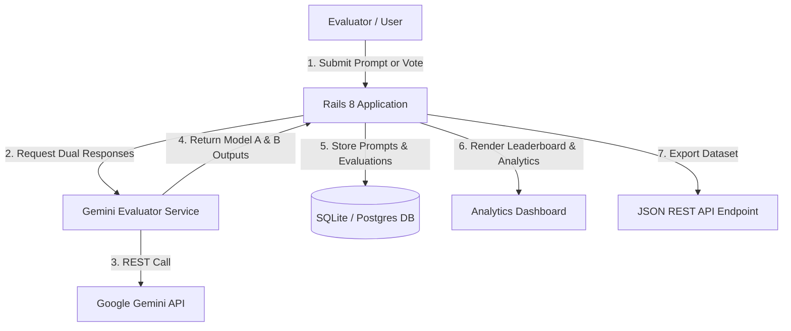

# ⚡ EvalRails - AI Model Evaluation & Comparison Studio

> A production-ready, globally deployable **Ruby on Rails 8** platform for evaluating, scoring, and benchmarking AI Language Model outputs.

[](https://rubyonrails.org/)
[](https://www.ruby-lang.org/)
[](LICENSE)
[](Dockerfile)

---

## 🎯 Overview

**EvalRails** is an open-source evaluation studio built for **AI Model Evaluation Specialists**, researchers, and developers. It allows users to prompt multiple AI models simultaneously, compare responses side-by-side in a blind test, rate model performance across multi-dimensional criteria, and view live win-rate leaderboards.

Whether testing response accuracy, instruction-following adherence, code generation quality, or hallucination rates, **EvalRails** provides the structured workflow needed to build reliable AI evaluation benchmarks.

---

## ✨ Features

- ⚔️ **Blind Side-by-Side Arena (Model A vs. Model B)**: Evaluators vote on outputs without knowing model identities, avoiding preference bias.
- 📊 **Multi-Dimensional Quality Scoring**: Rate responses from 1 to 5 stars on **Factual Accuracy**, **Response Clarity**, and **Instruction Following**.
- 🏆 **Live Win-Rate & ELO Leaderboard**: Real-time calculated win percentages, total pairwise evaluations, and category performance scores.
- 🤖 **Google Gemini API Integration**: Native support for live Gemini models (`gemini-1.5-flash`, `gemini-1.5-pro`) with graceful offline fallback simulation.
- 📂 **JSON Benchmark Dataset Export**: Built-in REST API endpoint (`/api/evaluations`) for downloading evaluation datasets for data science and model fine-tuning.
- 🐳 **Docker & Cloud Deployment Ready**: Includes production `Dockerfile`, `docker-compose.yml`, and `render.yaml` for 1-click cloud deployment.

---

## 🛠️ Tech Stack

- **Framework**: Ruby on Rails 8.0
- **Language**: Ruby 3.3
- **Frontend / UI**: HTML5, Vanilla CSS3 (Glassmorphism design system), Rails Turbo & Hotwire
- **Database**: SQLite3 (Production-ready via Solid Suite) / PostgreSQL supported
- **AI Integration**: Google Gemini API (`generativelanguage.googleapis.com`)
- **Containerization**: Docker & Docker Compose

---

## 🏗️ System Architecture



---

## 🚀 Quickstart Guide (Local Setup)

### Prerequisites
- Ruby 3.2+ (Ruby 3.3 recommended)
- Git

### 1. Clone & Install Dependencies
```bash
git clone https://github.com/your-username/eval_rails.git
cd eval_rails
bundle install
```

### 2. Database Setup & Seed Data
```bash
bin/rails db:migrate
bin/rails db:seed
```

### 3. (Optional) Configure Gemini API Key
To use live AI responses, set your Gemini API key:
```bash
export GEMINI_API_KEY="your_actual_gemini_api_key_here"
```
*(If no API key is provided, EvalRails automatically runs in Simulated Mode with realistic responses!)*

### 4. Start the Rails Server
```bash
bin/rails server
```
Visit `http://localhost:3000` in your web browser!

---

## 🐳 Running with Docker

```bash
docker-compose up --build
```
Open `http://localhost:3000`.

---

## 🌐 1-Click Cloud Deployment (Render.com)

1. Push this repository to your GitHub account.
2. Log into [Render.com](https://render.com) and click **New +** -> **Blueprint**.
3. Connect your GitHub repository. Render will automatically detect `render.yaml` and deploy your app globally!

---

## 📄 API Documentation

### Export Benchmark Evaluations
`GET /api/evaluations`

**Sample Response**:
```json
{
  "exported_at": "2026-09-08T08:30:00Z",
  "total_records": 12,
  "benchmark_dataset": [
    {
      "id": 1,
      "category": "Coding & Tech",
      "prompt": "Write a Ruby method `fibonacci(n)` using memoization...",
      "winner_model": "Gemini 1.5 Pro (Analytical)",
      "accuracy_score": 5,
      "clarity_score": 5,
      "instruction_score": 5,
      "evaluator": "Senior Evaluator"
    }
  ]
}
```

---

## 📜 License

Distributed under the MIT License. See `LICENSE` for details.
